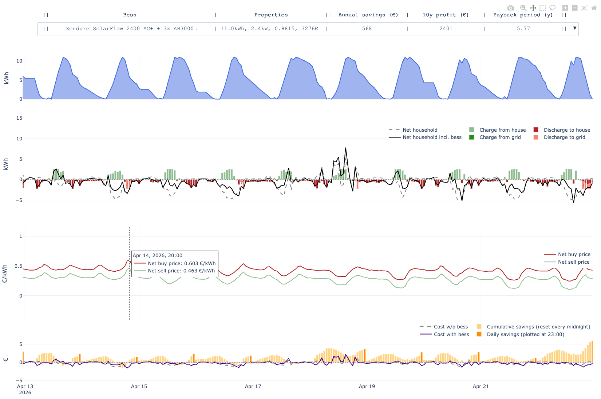

# BESS Compare

Compare any number of [Battery energy storage systems](https://en.wikipedia.org/wiki/Battery_energy_storage_system) (BESSs, a.k.a. home batteries) by simulating their expected savings for _your_ household. 

By providing your own household load profile and some BESS configurations that you are interested in, this tool shows 
1. how those batteries would ideally have behaved in your household in that time period
2. how much money they would have saved in that way



At the top you can select any BESS config, 
and the drop down menu itself shows some stats like payback period for each BESS, 
_assuming your household load profile will stay the same in upcoming years_:


This will give you a good idea of which BESS is the best fit for your household and your expected savings. 
(no guarantees given of course, this is my first open source project :))

[//]: # (![Visualization.mov]&#40;Visualization.mov&#41;)

## FAQ
#### Why not just use the tool on https://jeroen.nl/energie/opslaan/thuisbatterij/capaciteit-berekenen?
Jeroen's tool serves as a great first step for finding the battery capacity that's roughly ideal for your household. 
In contrast, this tool serves as a great second step for picking from some specific BESS configurations with such capacity.
  
## Setup and usage

1. Clone this repository
2. Install dependencies with uv from the root of the repo:
   ```bash
   uv sync
   ```
3. Optionally: run the example simulation to see how the tool works:
   ```bash
   python main.py
   ```
4. Get your (at least 1 year of) Tibber household load profile data using this [this tibber-export repo](https://codeberg.org/marians/tibber-export) and put the monthly CSVs in the `csv/` folder.
5. Add the battery configurations you want to compare to `src/batteries/bess_candidates.py`
6. Run your own simulation by specifying the folder with your CSVs:
   ```bash
   python main.py --csv_folder csv
   ```
 
## Notes
- 'net' means 'after potential taxes and fees' (not 'grid')

### Assumptions
- A household load profile under a dynamical electricity contract with hourly/quarterly prices. 
  - Currently Tibber is supported, but other providers can be added.
  - At least one year of household load profile data is required to accurately estimate your future energy bill.
- The Dutch salderingsregeling is abolished.
- The battery minimizes the household's energy bill every day right after 13:00 (when tomorrow's prices are known) by scheduling charging and discharging for the next 24 hours.
  - It uses linear programming to optimize this schedule.
  - To estimate the expected household load profile for the next 24 hours, it uses a moving average of the last 4 weeks (same hour of the week, so each average is over 4 data points).
- Currently, [DoD](https://en.wikipedia.org/wiki/Depth_of_discharge) is not modeled, hence the somewhat optimistic results in the example. Would you like to help improve this by becoming a contributor? :D