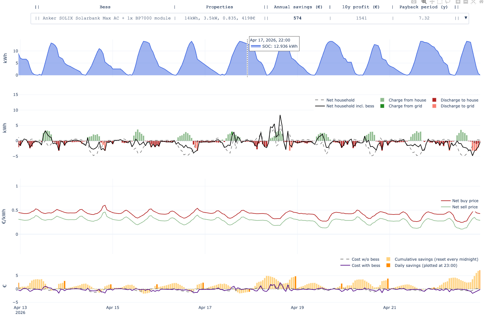
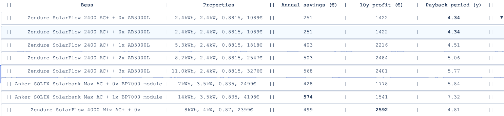

# BESS Compare

Compare any number of [Battery Energy Storage Systems](https://en.wikipedia.org/wiki/Battery_energy_storage_system) (BESS, a.k.a. home battery) configurations by simulating their expected savings for _your_ household. 

By providing your own household load profile and some BESS configs that you are interested in, this tool shows 
1. how those batteries would ideally behave in your household in such a time period
2. how much money they would have saved in that way



At the top you can select any BESS config, 
and the drop down menu itself shows some stats like payback period for each BESS, 
_assuming your household load profile will stay the same in upcoming years_:


This will give you a good idea of which BESS is the best fit for your household and your expected savings. 
(no guarantees given of course: your load profile might change, and so could the law, fees, etc)

[//]: # (![Visualization.mov]&#40;Visualization.mov&#41;)

## FAQ
#### Why not just use [Jeroen's tool](https://jeroen.nl/energie/opslaan/thuisbatterij/capaciteit-berekenen)?
Jeroen's tool serves as a great first step for finding the battery capacity that's roughly ideal for your household. 
In contrast, this tool serves as a great second step for picking from some specific BESS configs with such capacity.

#### What is a good starting point for finding the specs of candidate BESSes?
[Complete Thuisbatterij Vergelijker](https://energienerds.nl/index.php/2025/08/26/stekkerbatterijen-de-startgids) on Energienerds.nl could be your friend.
  
## Setup and usage

1. Clone this repository
2. Install dependencies with uv from the root of the repo:
   ```bash
   uv sync
   ```
3. Optionally: run the example simulation to see how the tool works:
   ```bash
   python main.py
   ```
4. Get your (at least 1 year of) Tibber household load profile data using this [this tibber-export repo](https://codeberg.org/marians/tibber-export) and put the monthly CSVs in the `csv/` folder.
5. Add the battery configs you want to compare to `src/batteries/bess_candidates.py`
6. Run your own simulation by specifying the folder with your CSVs:
   ```bash
   python main.py --csv_folder csv
   ```
 
## Notes
- 'net' means 'after taxes and fees' (not 'grid')

### Assumptions
- You have at least 1 year of household load profile data from a dynamical electricity contract with hourly/quarterly prices. 
  - Currently Tibber is supported, but other providers can be added.
  - At least one year of household load profile data is required to accurately estimate your future energy bill.
- The Dutch [salderingsregeling](https://www.rijksoverheid.nl/themas/klimaat-milieu-en-natuur/energie-thuis/salderingsregeling) is abolished.
- In the simulation, the battery minimizes the household's energy bill every day right after 13:00 (when tomorrow's prices are known) by scheduling charging and discharging for the next 24 hours.
  - A linear programming optimizes this schedule.
  - The expected household load profile for the next 24 hours is estimated by a moving average of the last 4 weeks (same hour of the week, so each average is over 4 data points).
  - Admittedly, most batteries in real life can operate in many other operational modes. This simulation only uses one that aims to minimize the expected energy bill. The current code structure can quite easily incorporate other modes.** 
- Currently not modeled (yet**):
  - [DoD](https://en.wikipedia.org/wiki/Depth_of_discharge)
  - Idle consumption of the battery
  - Imperfect coverage of self-consumption within each timestep (the battery's reaction on realtime usage has some lag)
Hence the somewhat optimistic results in the results of the example simulation.

**Would you like to help improve this by becoming a contributor? :D